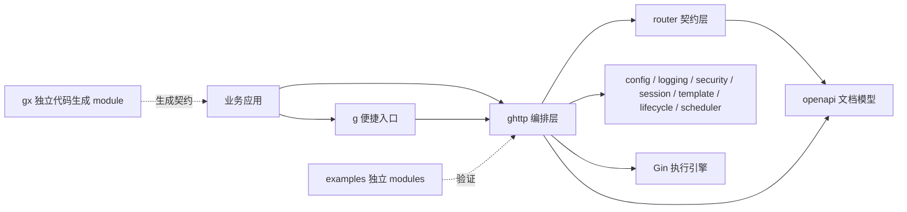
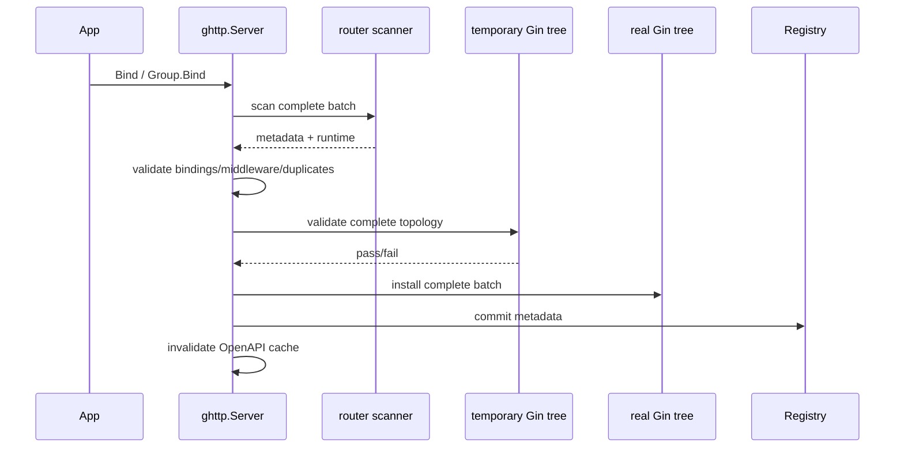
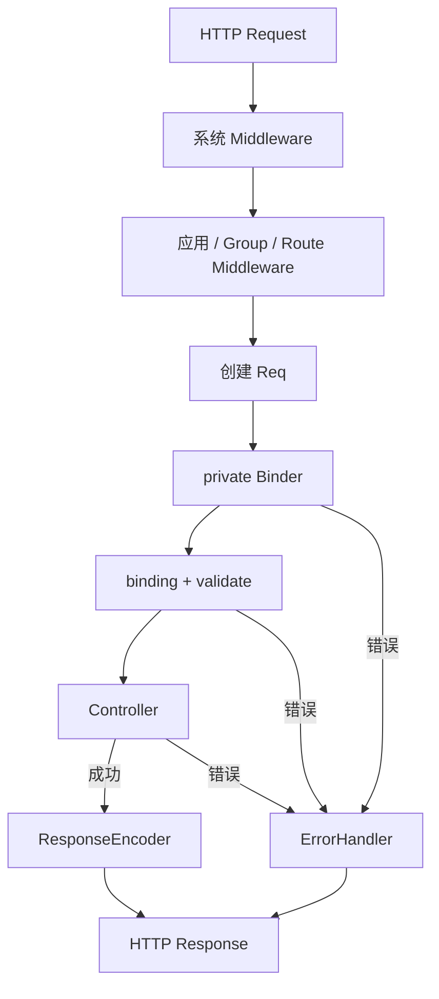

# gonex 架构设计

本文描述 gonex 的架构目标、模块边界、运行链路和演进约束。安装与使用见 [`README.md`](../README.md)，代码协作规则见 [`AGENTS.md`](../AGENTS.md)。

## 1. 设计目标

gonex 在 Gin 的 HTTP 执行能力之上提供声明式、可验证的 Web 开发契约：

- 请求结构体同时表达路由元数据、绑定来源、校验和 OpenAPI 信息；
- Controller 保持明确、可测试的输入输出签名；
- Server、RouterGroup 和 Route 提供分层 Middleware；
- 成功与失败响应有统一出口，基础设施可以替换；
- 多个 Server 在同一进程中保持实例状态隔离；
- 配置、日志、安全、Session、模板、静态资源、Lifecycle 和 Scheduler 形成完整但可替换的 Web runtime；
- 数据库、缓存、MQ、分布式锁等业务基础设施不进入 HTTP core；
- 工程分层和数据库代码生成位于独立 `gx` module。

当前处于 v1 前，错误公共 API 可以直接删除或重设计，不通过 alias、forwarder 或兼容快照延续错误契约。

## 2. 系统边界



依赖方向遵循“应用 → 编排 → 契约/能力 → 外部执行引擎”。`router`、`session`、`lifecycle` 等基础包不得反向依赖 `ghttp`。`contrib/*` 只能适配 core 接口，不能让 root module 反向依赖 GORM/Redis。

## 3. 模块职责

### 3.1 `g` 与 `ghttp`

`g` 提供 `g.Meta`、命名 Server 和默认配置等便捷入口。需要完全独立实例时直接使用 `ghttp.NewServer`。

`ghttp` 是组合根。每个 `Server` 拥有：

- Gin Engine 与 `http.Server`；
- route Registry 与 OpenAPI cache；
- response/error pipeline；
- Logger、SessionManager、Template Manager；
- Lifecycle 与 Scheduler；
- 动态安全配置和运行状态。

`Engine()` / `HTTPServer()` 是受限 escape hatch。业务路由仍必须经由 gonex 注册体系，否则 Registry、OpenAPI 和原子注册契约不再成立。

### 3.2 Router / Controller / Binder

Controller 扫描阶段完成反射和类型契约检查，输出声明信息与私有 runtime：

```text
Controller
  ↓
router.ScanController
  ↓
RouteMetadata ──→ Registry / OpenAPI
  ↓
RouteRuntime
  ↓
private compiled Binder
  ↓
Gin handler
```

`RouteMetadata` 是公开可检查、可复制的声明数据；Binder 是注册期编译出的私有执行计划，不暴露兼容 snapshot，也不保存 Server 的可变 multipart limit。

Registry 是框架的路由事实源；Gin radix tree 是执行后端。批量注册必须先对完整 batch 做 metadata、path binding、middleware、Registry 和临时 Gin tree preflight，通过后才能修改真实 Gin tree。

### 3.3 横切能力

- `config`：配置文件、`.env`、process env、runtime override；实例方法由锁保护。
- `logging`：结构化 Logger 抽象；Zap 是默认实现但不泄漏到公共接口。
- `middleware`：无 Server ownership 的底层 HTTP middleware；动态配置由 `ghttp` 管理。
- `session`：定义 `Storage`、MemoryStorage、CookieStorage 和 CookieRevocationStore contract；core 不内置 Redis client。
- `template`：root/functions/cache/watcher 由内部 RWMutex 协调。
- `static`：路径、root boundary、symlink 和扩展名安全检查。
- `lifecycle`：Hook、background task cancellation/barrier、phase state。
- `scheduler`：Cron/Every/Once、Timeout、Middleware、Overlap、persistent Loader/Locker/Recorder contract；内部 gocron 类型不泄漏。
- `openapi`：从 RouteMetadata 生成文档；runtime Binder/reflect method 不进入文档状态。

## 4. Server 构造与注册

`ghttp.NewServer` 的主要顺序：

1. 建立安全默认值和实例 owned state；
2. 应用显式 Options；
3. 应用 Config（Options 优先）；
4. 确定 Gin mode 并构造/接管 Engine；
5. 默认关闭 trusted proxies；
6. 构造 `http.Server`；
7. 安装 request/recovery/security middleware；
8. 配置 CORS、CSRF、Session、static、OpenAPI；
9. 把不可安全忽略的构造错误累积到 `Server.Err()`。

路由注册：



新增注册入口必须复用同一 preflight/commit 模型，不允许“前几个 route 成功、后一个失败”的半状态。

## 5. 请求执行链



Binder 不在请求热路径重新扫描 tag。Session value 在进入 framework ownership 时规范化为 JSON-safe detached value；`Get` 返回 detached copy。

HTTP response 一旦提交，错误处理不得再追加第二个 envelope；CookieManager 也拒绝在 response headers 已提交后写 Cookie，避免旧 token 已撤销但 replacement Cookie 无法发送。

## 6. 状态所有权与并发

| 状态 | 所有者与约束 |
| --- | --- |
| route registration / topology | Server；`registrationMu` 串行化，和运行状态保持 `registrationMu → stateMu` 锁顺序 |
| OpenAPI cache | Server；独立锁，route commit 后 invalidate |
| Host/CORS/CSRF | Server；`settingsMu` + immutable handler/snapshot |
| Session managed values | SessionManager/managedSession；canonical detached values |
| Cookie revocation store | 调用方注入；接口必须自行保证并发和持久化语义 |
| Scheduler records | Scheduler manager；manager lock + per-job overlap gate |
| Lifecycle phase/task state | Lifecycle；mutex + taskCount/taskDone barrier |
| Template state | Template Manager；内部 RWMutex |
| listener/running state | Server；listener/state locks |

任意注入对象（Logger、Config、Validator、Engine、Scheduler、Storage、CookieRevocationStore 等）由调用方拥有；framework 不通过反射做“万能深拷贝”。调用方若并发修改注入对象，对象本身必须线程安全。

## 7. Session 架构

服务端 Storage contract：

```go
type Storage interface {
    Get(context.Context, string) (map[string]any, error)
    Set(context.Context, string, map[string]any, time.Duration) error
    Delete(context.Context, string) error
}
```

CookieStorage 的签名 Cookie 仍位于客户端，因此可靠的 token rotation/logout 需要独立撤销状态：

```go
type CookieRevocationStore interface {
    IsRevoked(ctx context.Context, tokenDigest, familyDigest string, now int64) (bool, error)
    RegisterFamilyToken(ctx context.Context, familyDigest string, expiresAt, now int64) error
    RevokeToken(ctx context.Context, tokenDigest string, expiresAt int64) error
    RevokeFamily(ctx context.Context, familyDigest string, expiresAt, now int64) error
}
```

设计约束：

- CookieStorage 构造时必须显式传入 revocation store；
- framework 只把 SHA-256 digest 交给 store，不要求保存原始 token/family；
- `RegisterFamilyToken` 必须原子执行“family 是否已 revoke”检查和 latest-expiry 更新；
- `RevokeFamily` 必须覆盖该 family 已知的最大 token expiry，才能覆盖并发 in-flight request 已签发的 token；
- `MemoryCookieRevocationStore` 明确是 process-local，重启会丢失状态；
- 多实例/跨重启语义由业务注入共享 Redis/DB adapter，core 不依赖具体 client；
- 配置文件模式只有显式 `session.storage.revocation=memory` 才允许 process-local CookieStorage；共享 store 通过 `WithSessionManager` 注入。

Session mutation 使用事务式顺序：

```text
build replacement token/ID
→ validate outbound Cookie
→ revoke/delete authoritative old state
→ publish new Cookie
→ commit managed handle
```

因此后端 revoke/delete 失败时，旧 handle 不会被本地标记成成功轮换/退出。

## 8. Scheduler 架构

本地 Scheduler contract 与 gocron 解耦。`MutableScheduler.Replace` 是 persistent reconcile 的关键原子边界。

运行中的 Replace：

```text
clone + validate new Job
→ create unpublished replacement record
→ install replacement engine handle
→ cleanup old orphan handles
→ remove primary old engine handle last
→ commit manager record
→ switch overlap policy
→ publish replacement generation
```

replacement 在 publish 前即使被 engine 的 `RunImmediately` 触发，也只能等待 commit；失败则 abort，不允许执行未提交 generation。

跨 generation 复用同一个 overlap gate：

- `SkipIfRunning`：active 时跳过；
- `AllowOverlap`：允许并行 active；
- `QueueOne`：最多接受一个 pending trigger；
- 已被 QueueOne 接受的 trigger 是 committed work，后续 policy change 不得清空；
- AllowOverlap 切换到 QueueOne 后，由最后一个 active execution 接管 queued work，入队调用本身保持 non-blocking。

Persistent Loader 使用完整 desired state、Version token 和逆操作 rollback。相同 ID+Name+Version 不 Replace；数据库 writer 修改 runtime definition 时必须递增 Version。

Singleton 锁使用稳定 ID：

```text
scheduler:job:<JobDefinition.ID>
```

Locker、Recorder 是业务 adapter；panic/error 要被框架隔离，cleanup 使用 bounded background context。

## 9. Lifecycle 与 graceful restart

Server startup：

```text
OnStart
→ bind listener
→ start http.Server.Serve
→ Serve enters listener.Accept
→ OnStarted
→ restart-ready signal
→ Running
```

`OnStarted` 不再仅表示端口已 bind，而表示 Serve 已进入 Accept 路径，因此 hook 可以执行本机 HTTP readiness/self-check 而不会卡在“listener 存在但 Serve 尚未启动”的窗口。

Lifecycle 不允许同步 phase 自等待：

- active Start/Started/Shutdown/Stop 的并发或 hook reentry 返回 `ErrPhaseInProgress`；
- startup 中收到 shutdown 时立即记录 shutdown intent、取消 tracked tasks，并返回 `ErrStartupInProgress`；
- Server 等 startup unwind 后再执行真正 cleanup；
- tracked tasks 使用 `taskCount + taskDone` channel barrier，不使用 WaitGroup Add/Wait 时序。

Graceful restart：parent 把 listener FD 与 readiness pipe 交给 child；child 只有真正进入 Serve/Accept 后才发送 ready。ready 后 child 获得服务 ownership，parent 随后 graceful shutdown。即使 parent cleanup 返回错误，也不能再 kill 已 ready 的 child，否则可能在 parent listener 已关闭后造成服务完全中断。

## 10. 配置与安全

优先级：

```text
runtime Set > process env > .env > config file > default
```

安全默认值遵循显式授权：

- 默认不信任代理；
- CORS credentials + wildcard 禁止；
- SameSite=None 必须 Secure；
- Cookie 写入必须发生在 response headers commit 前；
- Body/multipart/Header 有上限；
- release/test 不向客户端暴露内部错误详情；
- static 校验 URL/path、root boundary、symlink 与 extensions。

## 11. gx 文件 publication

`gx/internal/gen/fs` 是生成器安全边界。普通文件事务和 DirectoryTransaction 从创建到 Commit/Rollback 持有 retained `os.Root`，publication/backup/delete/rollback 使用 descriptor-relative `Root.Rename` / `Root.Remove*` / `Root.MkdirAll`。

DirectorySwap 在任何 mutation 前进行完整 preflight：

- stage 必须位于 project root 内、existing、directory、non-symlink；
- target 必须 project-relative；
- target↔target 不得 equality/ancestor/descendant overlap；
- stage↔stage 不得 overlap；
- 任一 stage↔任一 target 不得 overlap。

最后一条防止备份某个 target 时把另一个 staged directory 一起搬走，导致事务在已 mutation 后才失败。

## 12. CI 与演进规则

仓库包含多个独立 Go modules，没有根级 `go.work`。强制矩阵：

```text
root:      tidy -diff + test + race + vet + diff-check
gx:        tidy -diff + test + race + vet
examples:  tidy -diff + test + race + vet
benchmarks tidy -diff + test + race + vet
contrib:   tidy -diff + test + race + vet
macOS/Windows: core + gx portability
```

稳定 v1 存在后，CI 使用 `gorelease` 对最新稳定 v1 做 public API compatibility gate。v1 前不维护全量 public API golden 来阻止有意 breaking cleanup；`test/api_freeze_test.go` 只防止已经明确删除的坏 compatibility surface 被重新引入。

每个行为变更形成闭环：

```text
production code + lowest-level tests
→ race/portability validation
→ examples/gx（若受影响）
→ README + AGENTS + architecture
→ final source review
```

最终审查至少回答：

1. API 是否简洁，是否偷偷保留兼容层？
2. state ownership、锁顺序和 caller-owned object 是否明确？
3. failure path 是否留下半注册、半替换、orphan handle 或不可回滚外部状态？
4. lifecycle/restart 是否存在自等待或 handoff 中断窗口？
5. Cookie revocation 是否具有声明的单机/多实例语义？
6. Scheduler replacement 是否阻止 unpublished generation 执行并保留 queued overlap work？
7. gx publication 是否在 mutation 前完成 overlap/symlink/root-boundary preflight？
8. 所有 module 的 tidy/test/race/vet 与 portability 是否通过？

只要答案不明确，就继续修复，而不是依赖未来兼容层掩盖问题。
