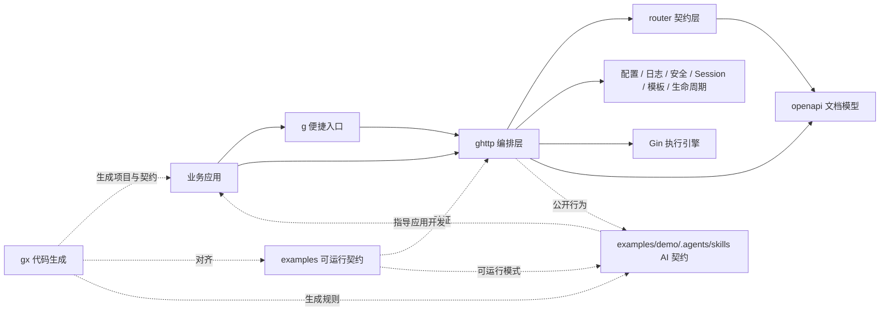
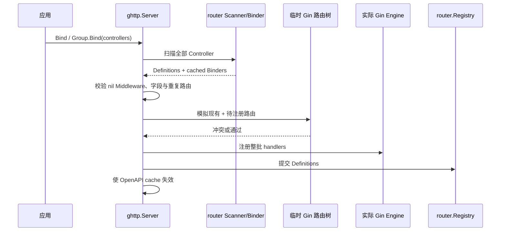
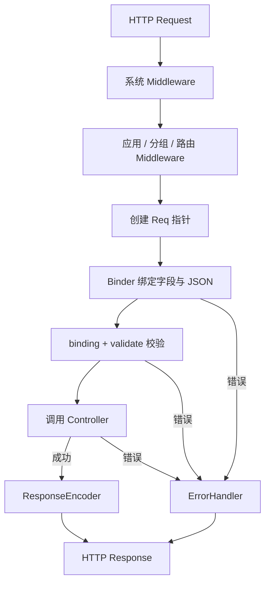

# gonex 架构设计

本文只描述 gonex 的架构目标、模块边界、运行链路和演进约束。安装与使用见
[`README.md`](../README.md)，代码协作规则见 [`AGENTS.md`](../AGENTS.md)，面向 AI 的应用开发
工作流见 [`examples/demo/.agents/skills`](../examples/demo/.agents/skills/)。

## 1. 设计目标

gonex 在 Gin 的 HTTP 执行能力之上提供声明式、可验证的 Web 开发契约：

- 请求结构体同时表达路由元数据、绑定来源、校验和 OpenAPI 信息；
- Controller 保持明确、可测试的输入输出签名；
- Server、RouterGroup 和 Route 提供分层 Middleware；
- 成功与失败响应有统一出口，基础设施可以替换；
- 多个 Server 在同一进程中保持状态隔离；
- 配置、日志、安全、Session、模板、静态资源和生命周期形成完整但可替换的 Web 运行时；
- 工程分层和数据库代码生成放在独立的 `gx` module，不把业务基础设施硬编码进 HTTP 核心。

非目标包括：在 HTTP 核心中内置 ORM/缓存/消息队列的业务抽象、替业务应用管理所有外部资源，
以及把 Gin API 原样包装一遍。

## 2. 系统边界



依赖方向遵循“应用 → 编排 → 契约/能力 → 外部执行引擎”。`router` 不依赖 `ghttp` 的错误类型；
`logging` 不暴露 Zap；`config` 不要求调用方理解 Viper；`contrib` 只能适配核心接口，不能让
核心包反向依赖具体业务组件。

## 3. 模块职责

### 3.1 入口与编排

`g` 提供 `g.Meta`、`g.Server(name...)`、`g.Cfg()` 等便捷入口。命名 Server 是进程级缓存，
同名返回同一实例，不同名称返回隔离实例。需要完全独立、无命名缓存的 Server 时直接调用
`ghttp.NewServer`。

`ghttp` 是组合根。`Server` 拥有 Gin Engine、框架路由表、响应编码器、错误处理器、
Logger、SessionManager、模板管理器、OpenAPI 缓存、配置快照和生命周期。它负责把较小的
组件按固定顺序组装起来，而不是把每种能力的实现都写进一个文件。

### 3.2 路由契约

`router` 负责解析请求类型上的 `g.Meta` 和字段标签，构造 `Definition` 与可复用 `Binder`。
这里完成反射、类型校验和字段路径收集；路由参数契约在 `ghttp` 注册最终路径时检查，因此
RouterGroup 前缀声明的参数也会参与一一对应校验。请求热路径只实例化请求、绑定值、执行校验并
调用 Controller。

框架维护自己的 `Registry`，因为 Gin 的路由树只适合执行，不足以承担路由快照、OpenAPI、
隔离测试和框架级冲突语义。Registry 对外返回深拷贝，调用方不能修改 Server 内部状态。

### 3.3 横切能力

- `config` 解析配置文件、`.env`、环境变量和运行时覆盖；Unmarshal 从目标结构发现 ENV-only 嵌套键，
  Set/Get/Unmarshal 由实例锁保护；Server 只依赖小型 `Config` 接口。
- `logging` 定义结构化 Logger；Zap、标准库日志和 Gin 输出都汇入同一接口。
- `middleware` 提供无 Server 状态的底层实现，`ghttp` 决定安装时机和动态配置。
- `session` 定义存储边界并提供内存、签名 Cookie、Redis 后端；可选 ContextStorage 把请求取消和
  tracing 传到 I/O。Cookie Token 族撤销是进程内状态；共享 Redis client 的所有权仍属于应用，
  只有显式 Owned storage 才在 Flush 时关闭 client。
- `template`、`static` 分别管理模板生命周期和安全文件访问；模板函数先校验再提交。静态资源拒绝
  越界、编码绕过、反斜杠和符号链接逃逸，再按扩展名白名单授权；GET/HEAD 先在临时路由树整组
  验证，注册失败不留下部分状态。
- `lifecycle` 管理 Hook、任务取消和等待，`ghttp` 把它连接到监听器和系统信号。
- `openapi` 从框架路由定义生成文档；Swagger 只是同一文档能力的 UI。

### 3.4 生成器、示例与 AI skills

`gx` 有独立 `go.mod`，只在开发期运行。命令从当前目录向上发现最近的 `go.mod`，所有项目相对路径
都以该 module root 解析。`gx init` 的 release 使用对应 `gx/vX.Y.Z` tag，pseudo-version 使用对应
commit，只有本地开发构建读取 `main`；下载 GitHub archive 中的规范 `examples/demo/` 后，在 staging
中完成安全解包、清单验证和项目标识替换后提交；`gx ctrl` 从 API 生成 Controller 契约；
`gx service` 从 Logic 生成 Service 并删除已不存在模块的受管聚合 import；`gx dao` 在 staging 中
生成并校验 GORM DAO/Entity，成功后成对替换，后续 module 更新失败则回滚。

`examples/demo/` 是唯一项目初始化模板，只集成 PostgreSQL，并携带 README、AGENTS、Codex agents 和
应用开发 skills。`gx init` 不维护第二份字符串模板。`examples` 是跨模块契约测试：

- `basic` 证明最小路由、绑定、响应和接口文档链路；
- `quick-demo` 证明 `gx init` 风格分层、生成代码、多 Server 和数据库生命周期；
- `template-demo` 证明模板配置、渲染和热更新。

公共行为变化时，生成器负责让新项目使用新契约，examples 负责证明已有项目可运行。

`examples/demo/.agents/skills/` 是同一契约面向 AI 开发工具的任务化投影：它不定义新的运行时能力，而是把 API
参数、Controller 边界、Logic/Service 注册、生成文件所有权和审查闭环按需提供给使用框架的项目。
代码和测试是事实来源，`gx` 是新代码投影，examples 是可运行证明，skills 不能脱离三者独立演进。

## 4. Server 构造流程

`ghttp.NewServer` 按以下顺序构造实例：

1. 创建安全默认值、Registry、Logger、Session、模板、生命周期和响应组件；
2. 应用显式 Option；
3. 加载并应用默认配置，Option 保持更高优先级；
4. 在创建 Gin Engine 前确定 Gin mode；
5. 默认禁用 trusted proxies，并建立 `http.Server`；
6. 安装系统 Middleware：Request ID、请求 Logger、框架 Context、访问日志、Recovery、Host 校验、
   请求体限制；框架 Context 在应用 Middleware 前创建并贯穿 Controller；
7. 配置 CORS、CSRF、静态资源、OpenAPI JSON 和 Swagger 路由；
8. 将不可安全忽略的构造错误累积到 `Server.Err()`。

构造函数返回 `*Server` 而不是 `(*Server, error)`，是为了保持 Option 风格和便捷入口；因此应用
启动代码必须在 Bind/Run 前检查 `server.Err()`。`Bind` 和 `Run` 也会阻止带初始化错误的实例继续
工作。

## 5. 路由注册流程



先使用临时 Gin Engine 模拟注册，是为了捕获参数路由、catch-all 等 Gin radix tree 冲突。只有
完整批次通过后才修改实际 Engine，从框架视角保持失败原子性。新增注册入口必须复用同一验证
路径，不能绕过 Registry 或直接把 Gin 当成唯一事实来源。

Middleware 的语义顺序为：

```text
系统级 → Server.Use 应用级 → RouterGroup/Bind 级 → Route.Use 路由级 → Controller
```

应用级 Middleware 必须在第一次 Bind 前安装，路由级 Middleware 也必须在目标路由注册前配置。

## 6. 请求执行流程



Controller 的规范签名是：

```go
func (c *Controller) Action(ctx context.Context, req *ActionReq) (*ActionRes, error)
```

请求仍必须是结构体指针；成功响应则允许任何可由 JSON 编码器处理的值或指针，包括命名 slice、map、标量、
array、interface 和 struct。`gx` 默认生成指针响应签名，但运行时校验不再要求响应必须是 `*struct`。

绑定来源分为两类：

- `path`、`query`、`header`、`cookie`、`form`、`file` 会在注册阶段生成 `FieldBinding`；
- JSON 请求体依据 Content-Type 和标准 `json` 标签解码，不保存为 `FieldBinding`。

非 JSON 参数缺失时，Binder 按字段来源读取顺序应用 `default` 值，再进入 `binding` 和 `validate`；显式
传入值保持不变。`default` 和短别名 `d` 等价，路径参数不支持默认值，JSON body 的 `default`/`d` 只描述 OpenAPI 契约。

`binding` 与 `validate` 是两套独立契约。应用分别通过 `WithBindingValidator` 和 `WithValidator` 注入
配置完成的独立 Validator；框架在构造后只并发读取它们，不在请求期间切换 tag name 或修改内部缓存。
自定义 struct-level 规则通常注册在 `validate` Validator，因此每次请求只执行一次。

成功默认编码为 `{"code":0,"message":"OK","data":...}`。框架错误使用 `ghttp.Error` 保存
业务码、HTTP 状态、消息、Cause 和可选 Details；Details 仅在 debug 模式返回。若 Controller 或
自定义编码器已经提交响应，错误路径不能再追加第二份 JSON。

## 7. OpenAPI 设计

路由定义是 OpenAPI 的输入，而不是反向从 Gin handlers 推断。这样请求标签、校验规则、Summary、
Tags 与实际绑定契约来自同一类型信息。

OpenAPI JSON 和 Swagger UI 共用 `openapiEnabled` 总开关；默认路径分别为 `/openapi.json` 和
`/docs/`。路由变化会使当前 Server 的文档缓存失效，不影响其他 Server。全局 Swagger HTML 模板
是少数明确的进程级扩展点，使用 `{SwaggerUIDocUrl}` 占位符，空字符串恢复默认模板。

## 8. 状态所有权与并发

每个 Server 实例拥有并保护以下状态：

| 状态 | 所有者与约束 |
| --- | --- |
| 路由表与注册状态 | Server；注册串行化，启动后不可改变拓扑 |
| OpenAPI cache | Server；路由提交后失效，读写加锁 |
| 配置、Logger、Session、模板 | Server；实例间不共享可变状态；同一请求缓存一个 Session，Logout 后驱逐并可重新打开 |
| 动态安全设置 | Server；请求读取快照，更新时加锁 |
| Listener 与运行状态 | Server；防止重复启动和运行期危险修改 |
| 生命周期 Hook 与任务 | Lifecycle；阶段成功状态只提交一次，失败轮次可重试；Server 启动失败后终止该实例；任务在关闭时取消并等待 |

进程级状态仅保留给确有全局语义的能力，例如 Gin mode、`g.Server(name)` 缓存、默认配置/Logger 和
Swagger 模板。Gin 的默认 Writer/Debug callback 也是上游包级状态：框架会串行化路由注册并在注册前
绑定当前 Server Logger，但应用直接写 Gin 全局 Writer 时会进入最近配置的 Logger，不能视为严格的
多 Server 隔离。新增全局状态必须同时提供并发安全、重置/隔离策略和多 Server 测试。

## 9. 配置与安全原则

有效配置优先级为：

```text
运行时 Set > 系统环境变量 > 项目 .env > 配置文件 > 框架默认值
```

默认配置文件搜索顺序为 `config.yaml`、`config/config.yaml`、
`manifest/config/config.yaml`。数据库生成和 quick-demo 运行时共享 `DATABASE_*` 环境配置；
数据库凭据不写入 Web YAML。

安全默认值遵循显式授权：不信任代理、CORS 不默认放行 `*`、限制请求体和 Header、Host 可白名单、
CSRF 使用 double-submit cookie、`SameSite=None` 必须配合 Secure、release/test 不暴露错误详情。
改变这些默认值属于公共行为变更，必须有安全回归测试、当前 README 说明和 example 配置。

## 10. 生命周期

启动顺序为 `OnStart` → 创建/绑定 Listener → `OnStarted` → Serve。两组启动 Hook 都只在全部成功后
提交各自阶段状态。独立 `lifecycle.Lifecycle` 的同阶段并发调用等待正在执行的同一轮，失败轮次可
重试；HTTP `Server.Run*` 不支持并发运行，启动失败会执行完整 Shutdown，该 Server 实例不再复用。
关闭时取消跟踪任务并执行 `OnShutdown`，关闭 HTTP Server 与模板，等待任务，Flush
Session/Logger，最后执行 `OnStop`。

业务数据库、消息消费者等外部资源由应用创建，并通过 Hook 释放。框架不猜测资源所有权；注入的
共享 client 默认不由框架关闭。

## 11. 演进规则

每个框架行为变更都必须形成一条闭环：

```text
核心契约与测试 → examples/demo 与 gx 新项目及生成契约 → example 可运行证明 → README/架构事实 → AI skills
```

设计评审至少回答：

1. 能力属于 HTTP 编排、通用契约、可选适配器还是应用层？
2. 状态由谁拥有，多个 Server 是否隔离，并发访问如何保护？
3. 注册失败、启动失败和关闭超时是否可观察、可恢复？
4. 默认值是否安全，配置优先级是否保持一致？
5. `gx init` 或其他生成命令是否会产生过时代码？
6. 哪个 example 能证明行为，哪些 README 和架构段落需要同步？
7. 哪些 skill 会把该行为作为应用开发规则，是否需要同步入口、reference 或审查清单？

仅内部重构若不影响生成器、示例或文档内容，也必须完成上述检查，并在交付记录中说明不受影响的
依据。完整执行规则见 [`AGENTS.md`](../AGENTS.md)。
